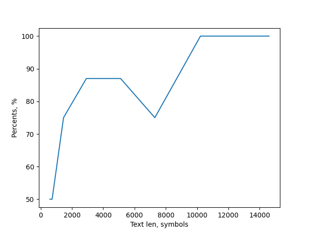
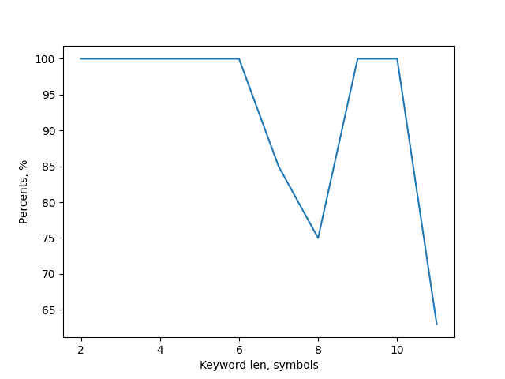

# Лабоарторная работа №1
### Криптоанализ методов простой подстановки
Простейшие шифры подтсановки (substitution) реализуют замену каждого символа исходного текста на один из символов алфавита шифротекста. В общем случае подстановочный шифр описывается таблицей подстановки, состоящей из двух строк и ***n*** столбцов. Количество столбцов таблицы подстановки соответствует количеству различных символов в алфавите исходного текста. Верхняя строка таблицы подстановки содержит все возможные символы исходного текста, а нижняя - соответствующие им символы шифротекста.
***Задания***

+ Реализовать программоное средство, осуществляющее криптоанализ зашифрованного по методу Виженера текста. Для криптоанализа использовать тест Касиски.

+ Произвести экспериментальное исследование зависимости вероятности успешного проведения атаки по методу Касиски от длины шифротекста. Построить графики.

+ Провести экспериментальное исследование зависимости вероятности успешного проведения атаки по методу Касиски от длины использованного при шифровании ключевого слова. Построить графики

**Замечание**: для каждой выбранной длинны шифртекста или ключевого слова должно быть проведено исследование по не менее чем 10 различным текста. Желательно, чтобы корпус текстов с разными длиными, а также корпус текстов для разных длин ключей, имел минимальное пересечение.

***ПРИЛОЖЕНИЕ 1. Частотность букв английского языка***
```
A 0.08167   J 0.00153   S 0.06327
B 0.01492   K 0.00772   T 0.09056
C 0.02782   L 0.04025   U 0.02758
D 0.04253   M 0.02406   V 0.00978
E 0.12702   N 0.06749   W 0.0236
F 0.0228    O 0.07507   X 0.0015
G 0.02015   P 0.01929   Y 0.01974
H 0.06094   Q 0.00095   Z 0.00074
I 0.06966   R 0.05987
```

***ПРИЛОЖЕНИЕ 2. Частотность букв русского языка***
```
А 0.07821   Н 0.0685    Ы 0.01854
Б 0.01732   О 0.11394   Ь 0.02106
В 0.04491   П 0.02754   Э 0.0031
Г 0.01698   Р 0.04234   Ю 0.00544
Д 0.03103   С 0.05382   Я 0.01979
Е 0.08567   Т 0.06443
Ё 0.0007    У 0.02882
Ж 0.01082   Ф 0.00132
З 0.01647   Х 0.00833
И 0.06777   Ц 0.00333
Й 0.01041   Ч 0.01645
К 0.03215   Ш 0.00775
Л 0.04813   Щ 0.00331
М 0.03139   Ъ 0.00023
```

### Результаты

