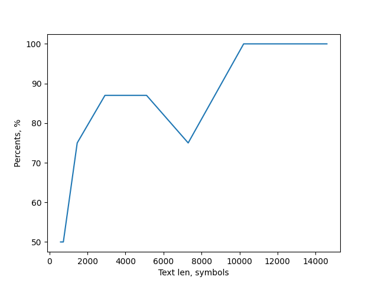
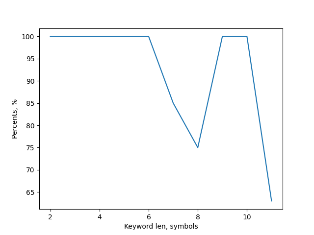

# Report
Vigenere Cipher by Timofei Alekceychick
## test 1: with fixed keyword length
text len|keyword|: len|found keyword|: len|success probability
---|---|---|---|---|---
583|ABSTRACT|8|ABWCCACP|8|50%
729|ABSTRACT|8|ABSCVAHA|8|50%
1459|ABSTRACT|8|ABSTGACC|8|75%
2919|ABSTRACT|8|ABSARACT|8|87%
5109|ABSTRACT|8|ABSTJACT|8|87%
7299|ABSTRACT|8|ABGTDACT|8|75%
10218|ABSTRACT|8|ABSTRACT|8|100%
11678|ABSTRACT|8|ABSTRACT|8|100%
13138|ABSTRACT|8|ABSTRACT|8|100%
14598|ABSTRACT|8|ABSTRACT|8|100%

## test 2: with fixed text length
text len|keyword|: len|found keyword|: len|success probability
---|---|---|---|---|---
6000|AS|2|AS|2|100%
6000|KEY|3|KEY|3|100%
6000|SORT|4|SORT|4|100%
6000|FORCE|5|FORCE|5|100%
6000|SECRET|6|SECRET|6|100%
6000|COLORED|7|COXORED|7|85%
6000|ABSTRACT|8|ABGTAACT|8|75%
6000|YESTERDAY|9|YESTERDAY|9|100%
6000|FLYCATCHER|10|FLYCATCHER|10|100%
6000|OPPOSITIONS|11|OPPHSINFOUS|11|63%

