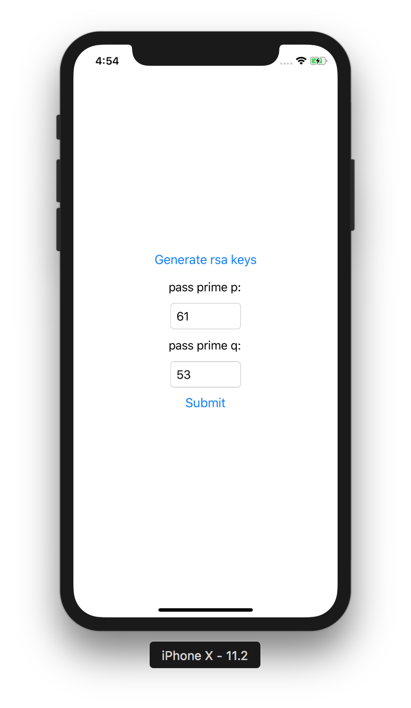
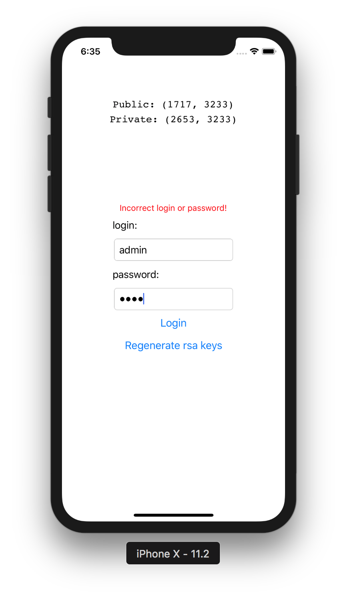
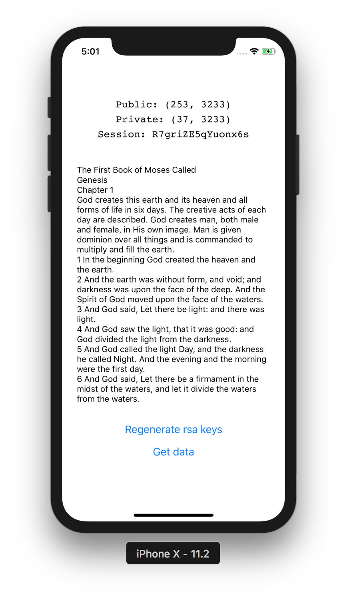

# Лабораторная работа №2
## «Защищенный блокнот»
### Условие:
***Написать программу "Защищенный блокнот" реализующую шифрование и просмотр зашифрованных текстовых файлов алгоритмом AES, Serpent или IDEA***

1) Серверная часть программы:

* хранит текстовые файлы
* генерирует случайный сеансовый ключ по запросу клиента
* отправляет клиенту зашифрованный сеансовым ключом текстовый файл
* отправляет клиенту зашифрованный открытым ключом RSA сеансовый ключ
2) Клиентская часть программы:

* Генерирует и отправляет серверу открытый ключ RSA (единожды)
* Расшифровывает и отображает текстовый документ при помощи сеансового ключа
* Ключ [RSA](https://en.wikipedia.org/wiki/RSA_(cryptosystem)) сохраняется (генерируется по нажатию кнопки)
Придумать метод хранения закрытого ключа.

Дополнительные задания:

1) Добавить в программу аутентификацию по паролю
2) Добавить срок годности к сеансовому ключу
3) Релизовать клиента на платформе Android

***Вариант 1:***
[AES](https://en.wikipedia.org/wiki/Advanced_Encryption_Standard) , режим сцепления блоков [CBC - Chipher Block Chaining](https://en.wikipedia.org/wiki/Block_cipher_mode_of_operation#CBC)

## Preview

