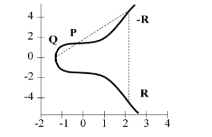

# Лабораторная работа №3
## Криптосистемы на основе эллиптических кривых
<strong>Эллиптическая кривая</strong> над множеством действительных чисел может быть определена как набор точек <i>(x, y)</i>, удовлетворяющих уравнению эллиптической кривой вида <i>y2 = x2 + ax + b</i> (<i>x</i>, <i>y</i>, <i>a</i> и <i>b</i> - действительные числа),  а также некоторый элемент <i>O</i>, называемый неопределенным (нулевым элементом). 
 
<strong>Эллиптическая группа <i>EM(a, b)</i></strong> представляет собой набор точек <i>(x, y)</i> с целыми положительными координатами, <i>x < M</i> и <i>y < M</i>, которые удовлетворяют соотношению <i>y2 = x3 + ax + b (mod M)</i>

### Задания
1. Для заданного <i>M = 47</i> определить значения <i>a</i> и <i>b</i>, которые позволяют построить эллиптическую группу <i>EM(a, b)</i>
2. Для найденных в задании 1 параметров сгенерировать все эелементы эллептической группы <i>EM(a, b)</i>
3. Реализовать алгоритм обмена ключами для эллиптической группы <i>EM(a, b)</i>
4. Разработать алгоритм цифровой подписи на основе эллиптической группы <i>EM(a, b)</i>