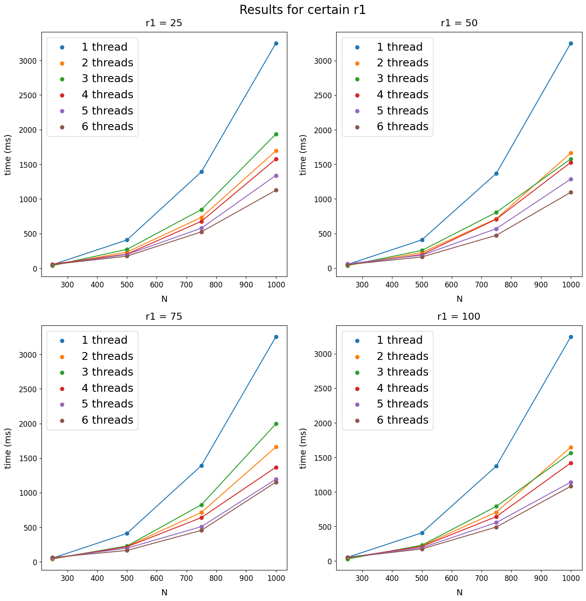
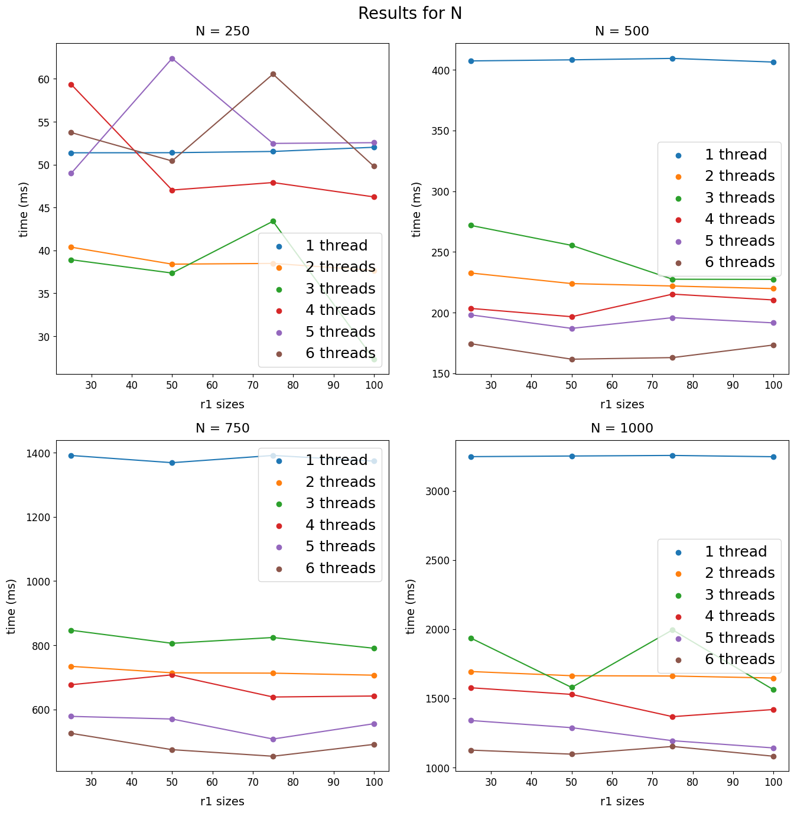

# Лабораторная работа №3
## Параллельная MPI-реализация алгоритма перемножения матриц
Рассматривается *ijk*-алгоритм перемножения двух квадратных матриц порядка N:
```
    do i = 1, N
        do j = 1, N
            S1: c(i,j) = 0
            do k = 1, N
                S2: c(i,j) = c(i,j) + a(i,k)*b(k,j)
            enddo
        enddo
    enddo
```
Требуется:
+ разработать параллельный алгоритм перемножения матриц согласно своему варианта задания
+ программно реализовать (C, MPI) разработанный параллельный алгоритм
+ отладить программы на персональном компьютере с помощью MPICH или аналогичной среды разработки MPI-программ
+ провести вычислительные эксперименты

Параметрами параллельного алгоритма должны быть:
+ размеры задачи
+ число процессов, используемых в вычислениях
+ размеры зерна вычислений (если, согласно варианту задания, разбивается более одного цикла)

В «теоретической» части ответа:
+ привести иллюстрации, поясняющие распараллеливание
+ указать начальное распределение данных
+ произвести выделение массивов
+ произвести оптимизацию вычислений в тайлах: введение новых массивов и операторов (после, а не до распрараллеливания!), вычесление границ цикла вне цикла
+ привести псевдокод (циклы, тайлы, операции обмена данными)
+ произвести сборку в нулевом процессе результатов вычислений (если результаты оказались распределены по процессам)
+ для каждого вхождения массива данных указать (и обосновать), локальны (временная, пространственная локальность) или нет данные.

Условие:

7. Тайлинг: $r_1$ - параметр, $Q_2$ - параметр, $r_2$ = roundup(N/Q), $r_3$ = 1;
s - координата: j;
коммуникации: трансляция части (согласованной с тайлом) А.

### Результат


